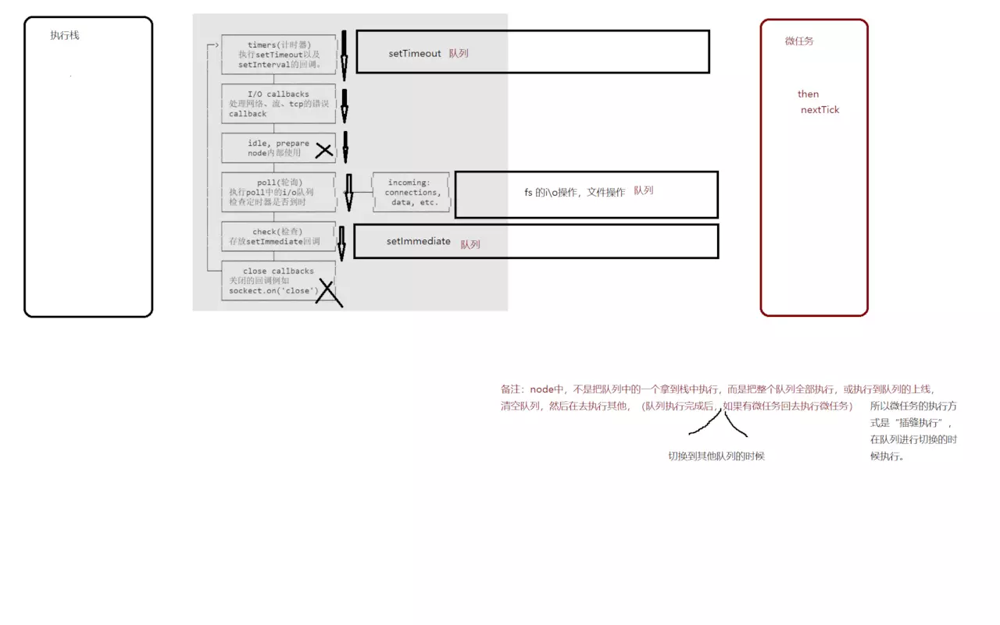

事件循环正在学习中，文中描述可能有误。

## 浏览器的 Event Loop

https://juejin.im/book/5b936540f265da0a9624b04b/section/5bb1815c6fb9a05d2d0233ad

## Node 的事件循环

### 循环阶段

```
   ┌───────────────────────┐
┌─>│        timers         │
│  └──────────┬────────────┘
│  ┌──────────┴────────────┐
│  │     I/O callbacks     │
│  └──────────┬────────────┘
│  ┌──────────┴────────────┐
│  │     idle, prepare     │
│  └──────────┬────────────┘      ┌───────────────┐
│  ┌──────────┴────────────┐      │   incoming:   │
│  │         poll          │<──connections───     │
│  └──────────┬────────────┘      │   data, etc.  │
│  ┌──────────┴────────────┐      └───────────────┘
│  │        check          │
│  └──────────┬────────────┘
│  ┌──────────┴────────────┐
└──┤    close callbacks    │
   └───────────────────────┘
```



+   timer 阶段

    timers 阶段会执行 `setTimeout` 和 `setInterval`。

    一个 timer 指定的时间并不是准确时间，而是在达到这个时间后尽快执行回调，可能会因为系统正在执行别的事务而延迟。
    
    下限的时间有一个范围：`[1, 2147483647]` ，如果设定的时间不在这个范围，将被设置为 `1`。

+   I/O 阶段

    I/O 阶段会执行除了 close 事件（close 阶段），定时器（timer 阶段）和 setImmediate（check 阶段） 的回调。

+   idle, prepare

    idle, prepare 阶段内部实现

+   poll

    poll 阶段很重要，这一阶段中，系统会做两件事情

    +   执行到点的定时器
    +   执行 poll 队列中的事件

    并且当 poll 中没有定时器的情况下，会发现以下两件事情

    +   如果 poll 队列不为空，会遍历回调队列并同步执行，直到队列为空或者系统限制
    +   如果 poll 队列为空，会有两件事发生
        +   如果有 setImmediate 需要执行，poll 阶段会停止并且进入到 check 阶段执行 setImmediate
        +   如果没有 setImmediate 需要执行，会等待回调被加入到队列中并立即执行回调

    如果有别的定时器需要被执行，会回到 timer 阶段执行回调。

+   check

    check 阶段执行 setImmediate

+   close callbacks

    close callbacks 阶段执行 close 事件

### 其他

`process.nextTick()` 会在每个阶段前触发。

Node 中的 process.nextTick 会先于其他 microtask 执行。

```js
setTimeout(() => {
  console.log("timer1");

  Promise.resolve().then(function() {
    console.log("promise1");
  });
}, 0);

process.nextTick(() => {
  console.log("nextTick");
});
// nextTick, timer1, promise1
```

## 举例

+   例 1

    ```js
    setTimeout(() => {
        console.log('setTimeout');
    }, 0);
    setImmediate(() => {
        console.log('setImmediate');
    })
    ```

    浏览器运行结果（Chrome 65.0.3325.181）

    ```
    setImmediate
    setTimeout
    ```

    **浏览器中，setImmediate 优先级比 setTimeout 更高。**

    然后在 Node 执行（v9.10.0）

    运行结果是不确定的。

    如果进入 Event Loop 的时刻小于 1ms，那么，`setImmediate` 会先执行（check 阶段）。

    如果进入 Event Loop 的时刻大于 1ms，那么，`setTimeout` 会先执行（timer 阶段）。

+   例 2

    ```js
    var fs = require('fs')

    fs.readFile(__filename, () => {
        setTimeout(() => {
            console.log('timeout');
        }, 0);
        setImmediate(() => {
            console.log('immediate');
        });
    });
    ```

    在 Node 中的运行结果是确定的：

    ```
    immediate
    timeout
    ```

    因为 `readFile` 的回调在 poll 阶段，发现有 `setImmediate`，立刻跳转到 check 阶段执行回调，再去 timer 阶段执行回调。

+   例 3

    ```js
    setTimeout(()=>{
        console.log('timer1')

        Promise.resolve().then(function() {
            console.log('promise1')
        })
    }, 0)

    setTimeout(()=>{
        console.log('timer2')

        Promise.resolve().then(function() {
            console.log('promise2')
        })
    }, 0)
    ```

    浏览器的运行结果：

    ```
    timer1 promise1 timer2 promise2
    ```

    Node 的运行结果是不确定的：

    ```
    timer1 promise1 timer2 promise2（小部分情况）

    或 

    timer1 timer2 promsie1 promise2（大部分情况）
    ```

    第一种情况（`timer1 promise1 timer2 promise2`）的原因可能是第一个定时器到期后（1ms 后）Event Loop 进入，执行 timer 阶段等，然后下一个定时器进入下一个 Event Loop 循环。

    第二种情况（`timer1 timer2 promsie1 promise2`）的原因可能是两个定时器到期后的事件循环开始，执行 timer 等阶段。

## 参考文章

+   https://acemood.github.io/2016/02/01/event-loop-in-javascript/
+   https://juejin.im/post/5ab4794b5188255583592bd4
+   https://juejin.im/post/5ab5012951882555712c4d3c
+   https://juejin.im/post/5b7a077a6fb9a019c476e51c
+   https://ustbhuangyi.github.io/vue-analysis/reactive/next-tick.html#js-%E8%BF%90%E8%A1%8C%E6%9C%BA%E5%88%B6