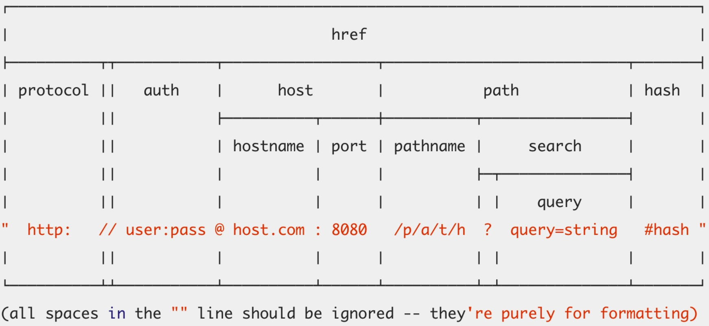

# url 解析

## 简介

```
const url = require('url');
```

url 模块是非常实用的模块，用来解析 url，它总共有三个方法。

下图是一个完整的 url 各部分：



## 模块方法概述

+   `url.parse(urlString)`：将 url 字符串解析成 object，便于开发者操作
+   `url.format(urlObj)`：`url.parse()` 方法的反向操作
+   `url.resolve(from, to)`：以from作为起始地址，解析出完整的目标地址

## url.parse(urlString[, parseQueryString[, slashesDenoteHost]])

+   `parseQueryString`: 默认为 false。

    表示是否 decode query 字符串。如果为 false，则不 decode query 字符串；否则会将 query 解析为对象，并将值 decode。

+   `slashesDenoteHos`：默认为false。

    如果为 true，那么类似 //foo/bar 里的 foo 就会被认为是 hostname；如果为 false，则 foo 被认为是 pathname 的一部分。

+   解析结果后文解释

## urlObj

[官方文档](https://nodejs.org/api/url.html#url_url_strings_and_url_objects)

+   protocol：协议，需要注意的是包含了:，并且是小写的。
+   slashes：如果:后面跟了两个 `//`，那么为 true。
+   auth：认证信息，如果有密码，为 `usrname:passwd`，如果没有，则为 usrname。注意，这里区分大小写。
+   host：主机名。注意包含了端口，比如 ke.qq.com:8080，并且是小写的。
+   hostname：主机名，不包含端口，并且是小写的。
+   hash：哈希部分，注意包含了#。
+   search：查询字符串，注意，包含了 `?`，此外，值是没有经过 decode 的。
+   query：字符串 或者 对象。如果是字符串，则是search去掉?，其余一样；如果是对象，那么是 decode 过的。
+   path：路径部分，包含 search 部分。
+   pathname：路径部分，不包含 search 部分。
+   href：原始的地址。不过需要注意的是，protocol、host 会被转成小写字母。

## url.format(urlObj)

完成 URL 拼接。[官方文档](https://nodejs.org/api/url.html#url_url_format_urlobject)

## url.resolve(from, to)

用法比较简单，直接贴官方文档的例子

```
url.resolve('/one/two/three', 'four')         // '/one/two/four'
url.resolve('http://example.com/', '/one')    // 'http://example.com/one'
url.resolve('http://example.com/one', '/two') // 'http://example.com/two'
```